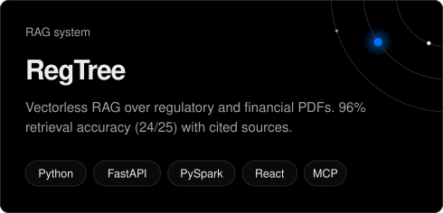
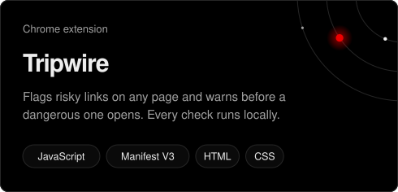
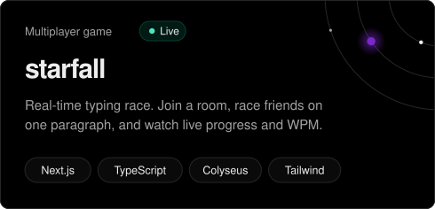
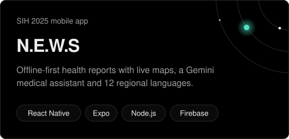
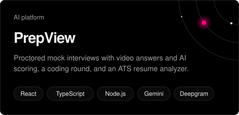
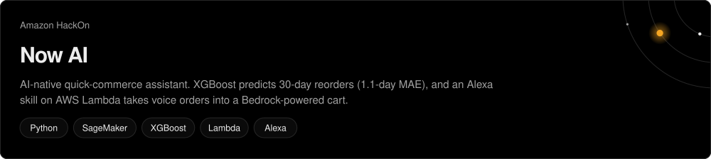

  

I build full-stack products with LLMs and retrieval at the core: React and FastAPI up front, RAG pipelines and computer vision behind them.

AI Engineer Intern at **Larsen & Toubro**, where I built an AR web app that detects objects with YOLOv11x and overlays live labels using Three.js and WebXR. Final-year Computer & Communication Engineering student at Manipal University Jaipur (CGPA 8.81). **SIH 2025 Grand Finalist** among 68,000+ teams, co-inventor on a published patent, and three-time Dean's List.

### Selected work

<table>
  <tr>
    <td width="50%">
      
    </td>
    <td width="50%">
      
    </td>
  </tr>
  <tr>
    <td width="50%">
      
    </td>
    <td width="50%">
      
    </td>
  </tr>
  <tr>
    <td width="50%">
      
    </td>
    <td width="50%">
      
    </td>
  </tr>
</table>

### Stack

**AI / ML:** LLM application development · Retrieval-augmented generation (vector and vectorless) · Model Context Protocol (MCP) servers · Computer vision (YOLOv11) · Model training and deployment on AWS SageMaker (XGBoost)

### Activity

[dhruvhonwad@gmail.com](mailto:dhruvhonwad@gmail.com) · [LinkedIn](https://www.linkedin.com/in/dhruv-honwad)
